  

  

  

# Hi, I'm Ishan 👋

B.Tech CS (AIML) @ KIT Kolhapur · Building at the intersection of AI, robotics, and full-stack development.  
Founder of the AI & Robotics Club · 1500+ students mentored · Top 20 @ Techfest IIT Bombay.

---

  

### 🛠 Tech Stack

**Languages**

**Frontend & Mobile**

**Backend & Infra**

**Database & Storage**

**Media & Streaming**

**3D / CAD / Creative Tools**

**AI / ML**

**Embedded & Hardware**

**Tools**

---

  

### 🤖 AI Tools I Use

---

  

### 📊 GitHub Stats

  

  
  

---

  

### 🚀 What I'm building

- **[FTPilot](https://marketplace.visualstudio.com/items?itemName=IshanKulkarni.ftpilot)** — VS Code extension that builds your project and FTP-deploys a git `deploy` branch to cPanel domains/subdomains in one click. [Live on the VS Code Marketplace](https://marketplace.visualstudio.com/items?itemName=IshanKulkarni.ftpilot) · [Source](https://github.com/IshanKulkarni02/ftpilot) (TypeScript)
- **Guitar Tutor** — On-device macOS AI guitar tutor: drop in any song, get it transcribed to notes (melody / chords / mix), practice in chunks, and get live mic + camera feedback. No cloud AI (Swift, SwiftUI, Core ML, Vision)
- **[AudioMixer](https://github.com/IshanKulkarni02/Mac_audio_mixer)** — macOS virtual audio mixer with per-app strips, routed through a Rust DSP core and a user-space Core Audio HAL plugin, controlled from a native SwiftUI app
- **[DBHelm](https://github.com/IshanKulkarni02/mongo-backup-tool)** — Cross-platform database manager for MongoDB, PostgreSQL, MySQL & SQLite — full-fidelity backups plus git-like snapshots, as a CLI, TUI, and desktop app
- **Smart LMS** — Cross-platform LMS with NFC-triggered lecture recording & WebRTC streaming
- **[DeskPanda](https://deskpanda.io)** — Task manager for teams, built at my day job

---

### 🧪 Side Projects

| Project | Stack | Highlight |
|---|---|---|
| [Monopoly OS](https://github.com/IshanKulkarni02/monopoly_OS) | FastAPI, React 19, Tailwind, SQLite, WebSockets, Docker | Game-night companion for real-life Monopoly — banker/host/player accounts, live play log, join by short code |
| [LANShare](https://github.com/IshanKulkarni02/file-shairing) | Node.js, Express, Sharp, PWA | Password-protected photo & video library on your own Wi-Fi — nothing leaves the network, installable on any device |
| [Mock Interview Bot](https://github.com/IshanKulkarni02/mock-interview-bot) | Flask, Ollama (Gemma 3), Docker | Upload a resume PDF, get a mock interview from a local LLM |
| [Portfolio Site](https://github.com/IshanKulkarni02/IshanKulkarniWebSight) | HTML, CSS, JavaScript, PWA | Installable personal site with service-worker offline support |

---

### 🤖 Past Projects

| Project | Stack | Highlight |
|---|---|---|
| [GyanBrige](https://github.com/IshanKulkarni02/GyanBrige) | Expo, Tauri, Fastify, tRPC, LiveKit | Self-hosted college LMS with live classes, AI notes, attendance & community — one codebase for web, mobile & desktop |
| [Courier Council](https://github.com/IshanKulkarni02/courier-council) | Ollama, Unsloth, LangGraph | Local-first AI career-discovery engine: generated training data, LoRA fine-tuning, and an interviewer agent |
| [Book-Learning Q&A LLM](https://github.com/IshanKulkarni02/book-learning-ai) | Unsloth, Ollama, RAG | RAG pipeline for context-aware literary Q&A |
| Film Matchmaking AI | TensorFlow, Flask, CNN, LLM | Tinder × LinkedIn for film — LLM understands artist/producer profiles, CNN powers matching |
| [Greeting Robot](https://github.com/IshanKulkarni02/Greeting-Robot) | Ollama, Flask, Raspberry Pi, OpenCV | Physical robot head with real-time face tracking & local LLM |
| Communicathon App | Flutter, React Native | Assistive app for sensory-impaired users (STT + TTS) |
| FaceVault Extension | YOLO, JavaScript | Browser extension for passwordless biometric login |

---

### 🏆 Highlights

- 🥇 **Top 20 International** — Techfest 2020, IIT Bombay
- 🤖 **Founded AI & Robotics Club (ARC)** — 120+ members, 1500+ students mentored, 12 events organized
- 📜 **Certified** — LLM Engineering · Python Bootcamp

---

### 📬 Reach me

